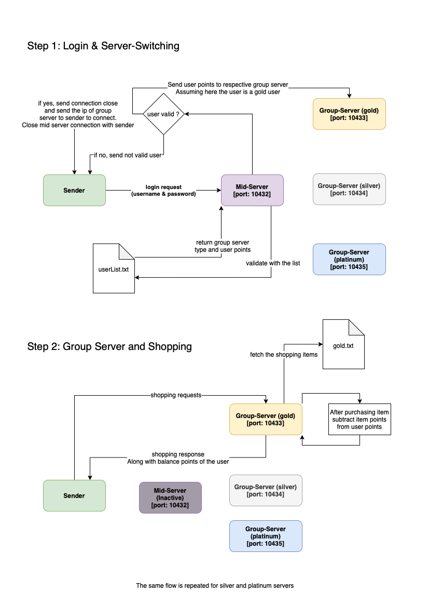

# Project 01 - Distributed Network
> Create a simple distributed network. There is a sender that communicates with the mid-server. The mid-server forwards the messages from the client to the dedicated the Group server.

## 1.Project Analysis
Here we need first split the problem into 2 sections (Server and Client). We can visualize that the Sender and Mid-Server is going to follow a server-client architecture and the Mid-Server and Group-server is again going to follow another server-client architecture. We will be using `Java` language to create this distributed system.

## 2. Flowchart


## 3. Basic Setup
We will start with the Client/Sender application.

### 3.a. Sender Program
 - Let's create a `SivadasanNairP1Sender.java` file.
 - We will get the IP address and the Port number of the MidServer from the command line arguments such
 as, 
 ```shell
 java SivadasanNairP1Sender 127.0.0.1 10432
 ```
 - We will recieve the arguments passed from the command line using 
 ```java
  public static void main(String[] args) {
    if (args.length < 1) print("Please provide the IP Address and Port Number");

    try {
      InetAddress ipAddress = InetAddress.getByName(args[0]);
      int port = Integer.parseInt(args[1]);
      ...
 ```
 - We will now create a socket object to connect to the server. Along with the socket, we also need to have a input stream and output stream to recieve and send messages from and to the server socket. We will be using the `Socket, DataInputStream, DataOutputStream and BufferedReader` Classes such as,
 ```java
  Socket socket = new Socket(ipAddress, port);
  DataInputStream in = new DataInputStream(socket.getInputStream());
  DataOutputStream out = new DataOutputStream(socket.getOutputStream());
  BufferedReader br = new BufferedReader(new InputStreamReader(System.in));
 ```
 - Next we need to create a variable that will store the input that is coming from the server such as,
 ```java
  String messageFromMidServer = in.readUTF();
 ```
 - Next let's keep listening for any message that comes to the sender using a while loop. We will listen for a `connection-closed` to terminate the connection. The code inside the while loop will always be executed as long as the server keeps responding to the client.
 ```java
  while(!messageFromMidServer.equals("connection-closed")) { ...
 ```
 - Let's have simple response handler functions, basically print statements which will let us know what kind of a message is coming from server. This was inspired from a web client-server request-response architecture.
 ```java
  if (messageFromMidServer.equals("100")) {
    print("Connection established with server!");
  }
  if (messageFromMidServer.equals("get-credentials")) {
    print("Enter the username and password");
  }
  if (messageFromMidServer.equals("401")) {
    print("Please login to the server!!");
  }
  if (messageFromMidServer.equals("logged-in")) {
    print("You are already logged in to the server!!");
  }          
  message = br.readLine();
  out.writeUTF(message);
  
  messageFromMidServer = in.readUTF();
 ```
 - Here, let's create a generic function called `print(String message)` to display any string message. This was a good approach when there was a need for using `System.out.println` multiple times in the same file.
 ```java
  public static void print(String message) {
    System.out.println(message);
  }
 ```
 - We need to close all the objects related to socket, which includes the socket itself and the input and output streams.
 ```java
  in.close();
  out.close();
  socket.close();
 ```

 ### 3.b. MidServer Program
