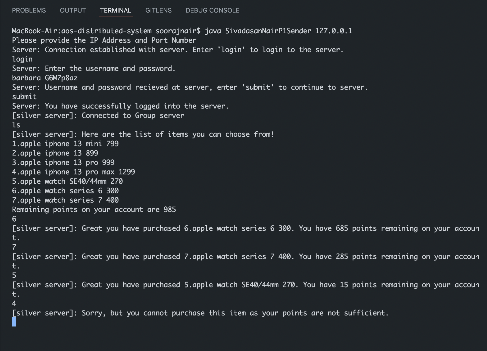
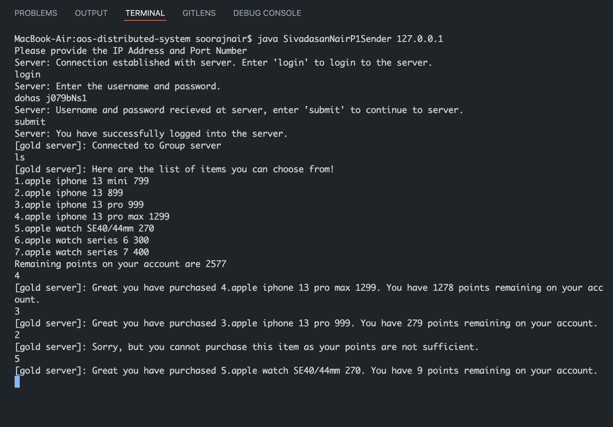
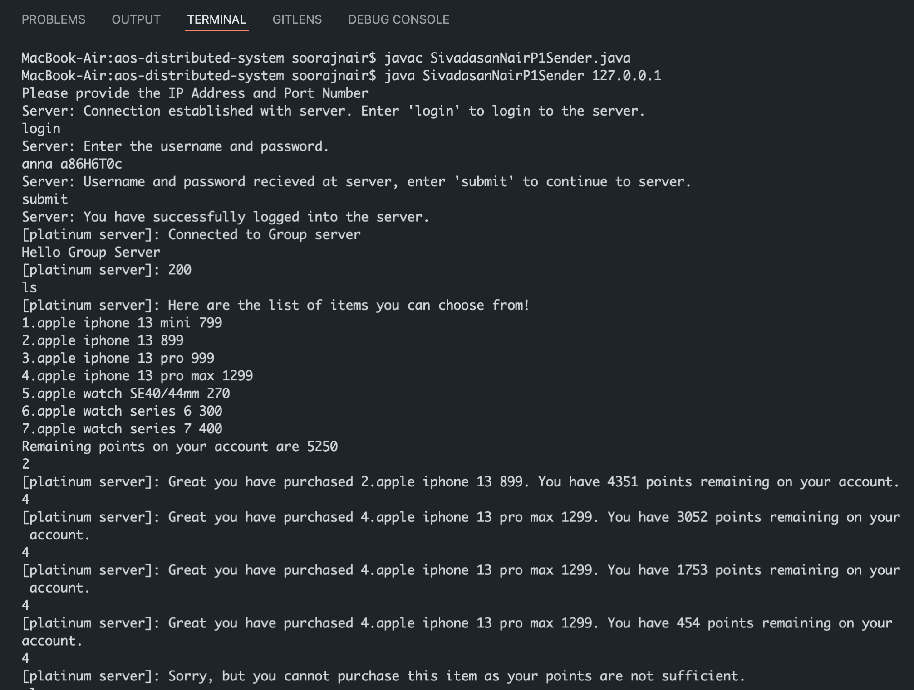

# Project 01 - Distributed Network
> Create a simple distributed network. There is a sender that communicates with the mid-server. The mid-server forwards the messages from the client to the dedicated the Group server.

## 1.Project Analysis
Here we need first split the problem into 2 sections (Server and Client). We can visualize that the Sender and Mid-Server is going to follow a server-client architecture and the Client and Group-server is again going to follow another server-client architecture. We will be using `Java` language to create this distributed system.

## 2. Flowchart


## 3. Overview & Basic Setup
We will start with the Client/Sender application.

### 3.a. Sender Program
 - Let's create a `SivadasanNairP1Sender.java` file.
 - We will get the IP address of the MidServer from the command line arguments such
 as `java SivadasanNairP1Sender 127.0.0.1`
 - We will recieve the argument passed from the command line to use as the IP Address (We will keep static port numbers). 
 - We will now create a socket object to connect to the server. Along with the socket, we also need to have a input stream and output stream to recieve and send messages from and to the server socket. We will be using the `Socket, DataInputStream, DataOutputStream and BufferedReader`.
 - Next we need to create a variable that will store the input that is coming from the server.
 - Next let's keep listening for any message that comes to the sender using a while loop. We will listen for a `connection-closed` to terminate the connection. The code inside the while loop will always be executed as long as the server keeps responding to the client.
 - Let's have simple response handler functions, basically print statements which will let us know what kind of a message is coming from server. This was inspired from a web client-server request-response architecture.
 - Here, let's create a generic function called `print(String message)` to display any string message. This was a good approach when there was a need for using `System.out.println` multiple times in the same file.
 ```java
  public static void print(String message) {
    System.out.println(message);
  }
 ```
 - We need to close all the objects related to socket, which includes the socket itself and the input and output streams.

### 3.b. MidServer Program
 - Let's create a `SivadasanNairP1MidServer.java` file.
 - We will get the IP address of the Group Server of the Sender from the command line arguments such as, `java SivadasanNairP1MidServer 127.0.0.1`
 - The MidServer keeps track of the user's authentication status using an `Auth` class. The `Auth` class is reponsible for login and logout of the user.
 - The `Auth` class keeps track of the user's authentication status.
 - Then we write a simple login function, that uses the username and password and compares it to the username and password in the file `auth/userList.txt`.
  - Now we will transfer the connection of the Sender from the MidServer to one of the group servers. In our case we will be using 3 types of Group servers (silver, gold and platinum). We will open the socket 
  communication to the server only once the user is an authenticated user.
  - After successfully logging in, we will send the Sender a message to terminate its connection to the Sender and also send the IP address of the Group server it needs to connect to.
  - The MidServer will also send the user's points to the Group Server, so that the Group Server can keep track of the user's purchase points.
  - We will close all our socket objects to prevent any memory leaks.

### 3.c. GroupServer Program
-  Let's create a `SivadasanNairP1GroupServer.java` file.
- For our group server we will create a Threadpool that can create a thread for every group server.
- Each thread is responsible for creating a server object. 
- Based on the type of the server, the Thread will excute the run method, which recieves the message from the sender
- Once the Sender is connected to the Group Server, the group server fetches the items from the data file once and loads into the program.
- The Sender can now use `ls` and numeric commands to fetch the list of items that are available for purchase and its corresponding points.
- The Sender needs to choose a number from the list of items and the Group Server will deduct the cost of the item from the points of the user.
- The Sender can keep purchasing until his/her points are empty.
- The Group Server can be closed from the Sender with the `close` command.

## Screenshots and Test Runs
1.Silver Server


2.Gold Server


3.Platinum Server
